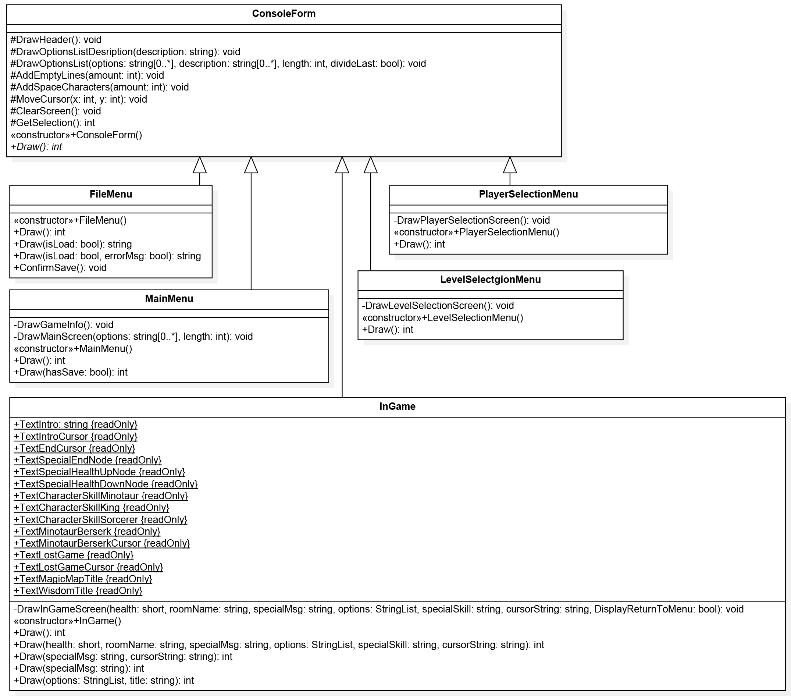

# Daedalus
A console based labyrinth game (c++)
Daedalus is terminal-based labyrinth game, where the user’s goal to find his way out before his life points run out. 

#Playing the game
The user can play with three different characters, each of them having a unique power. The user can also select between difficulty levels, which results in different sized, randomly generated labyrinth to play with. The program offers the options to save the current labyrinth to disk or load one from it. A labyrinth can be made up of three types of rooms: one which decreases the health, one which increases the health, and a neutral one. Each room has a random number of paths leading to other rooms, or to the exit eventually. The program ensures that all the generated labyrinths have at least one path which leads from start to the exit. At the end of each game, the player will be presented with some statistical data about his performance.

#Class diagrams
The program design uses the “Passive view” concept of the Model-View-Controller (MVC) architecture. Therefore the classes of are grouped into three layers based on their functionality:

-	View layer. Displays the information to the user in a formatted way, and gathers user input.
-	Controller layer. Manages the flow of the program, and retrieves the necessary data from the Model layer and passes it to the View layer for displaying.
-	Model layer. Handles the generation, load, save, and manipulation of the labyrinths. This is the business logic of the application.

##Overview diagram

##View layer diagram

##Controller layer diagram

##Model layer diagram

